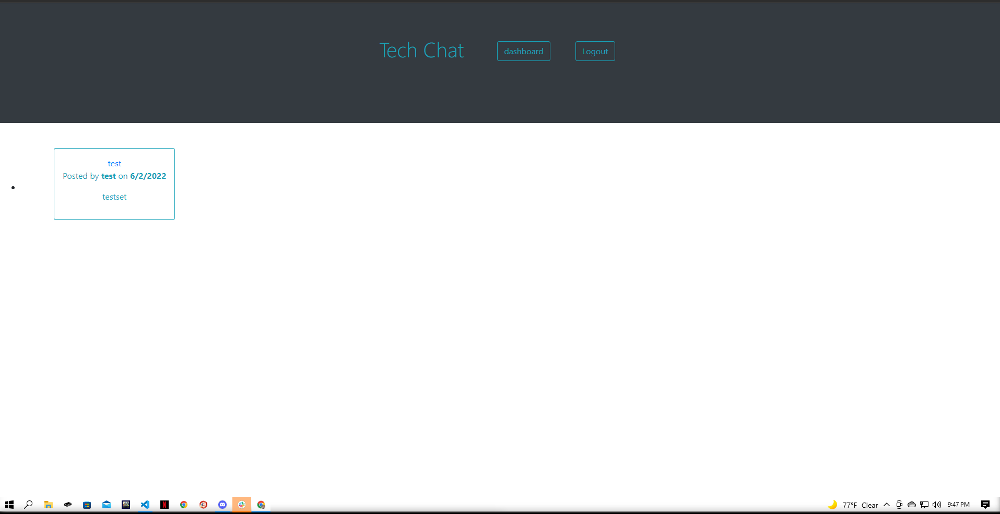

# Tech Chat

# Table of Contents
* [Description](#description)
* [Image](#image)
* [Deployed Link](#deployed-link)
* [Installation](#installation)
* [Contact](#contact)

# Description 
* An application used to interact with a community through posting and commenting

* The finished application deployed on Heroku

# Image

# Deployed Link
* <a href="https://tech-chat.herokuapp.com/">Tech Chat</a>

# Installation
* Download or clone repository
* Use a text editor to view all coding, Visual Studio Coding is recommended.

# Contact
<a href="https://github.com/JustynSubrai">Github</a>

[Return to top](#tech-chat)